# 🔥 Ember - Watch FrankenPHP Work, Live

This is a follow-along guide. If you can copy and paste, you can do the whole thing. We'll go from
**nothing** to **watching a live dashboard light up** as fake visitors flood the server. 😎

> **Ember** is a free tool that shows you, in your terminal, what a FrankenPHP server is doing *right now*.
> It's made by Alexandre Daubois - see https://github.com/alexandre-daubois/ember

> 📸 **About the screenshots:** every step below has a picture so you can check you're on track. Save your
> own captures into `docs/images/` using the filename shown under each step and they'll appear here.

---

## The big idea (in plain words)

Think of our web server as a **restaurant kitchen**:

- Every visitor to the website is a **customer** placing an order.
- FrankenPHP has a team of **cooks** (it calls them *threads* and *workers*).
- When lots of customers arrive, more cooks get busy. When it's quiet, the cooks wait around.

**Ember is a little window into that kitchen.** It shows how many customers are arriving, how many cooks
are busy, and how fast orders are coming out - and it updates every second.

By the end of this guide you'll send a big **wave of customers** at the kitchen and watch the numbers in
Ember climb up, fall down, and climb again. That's the whole show. 🔥

---

## What you need first

1. **The app running** (our FrankenPHP "worker" kitchen).
2. **The `ember` tool** installed on your computer.

Let's get both.

---

## Step 1 - Start the kitchen

Open a terminal in this project and run these three lines:

```bash
make up          # start the app + database helpers
make setup       # fill the database with ~10,000 products
make up-worker   # start the FrankenPHP worker (our star server)
```

Now check the kitchen is open. Open this in your browser:

- http://localhost:8081/en/products/db

> 💡 On **WSL / Windows / Linux** where Ctrl+click might not open it, run `make open URL=http://localhost:8081/en/products/db`
> (it detects WSL and opens your real Windows browser). `make urls` prints every demo URL to click.

We notice that we get a big list of products. The kitchen is cooking. ✅

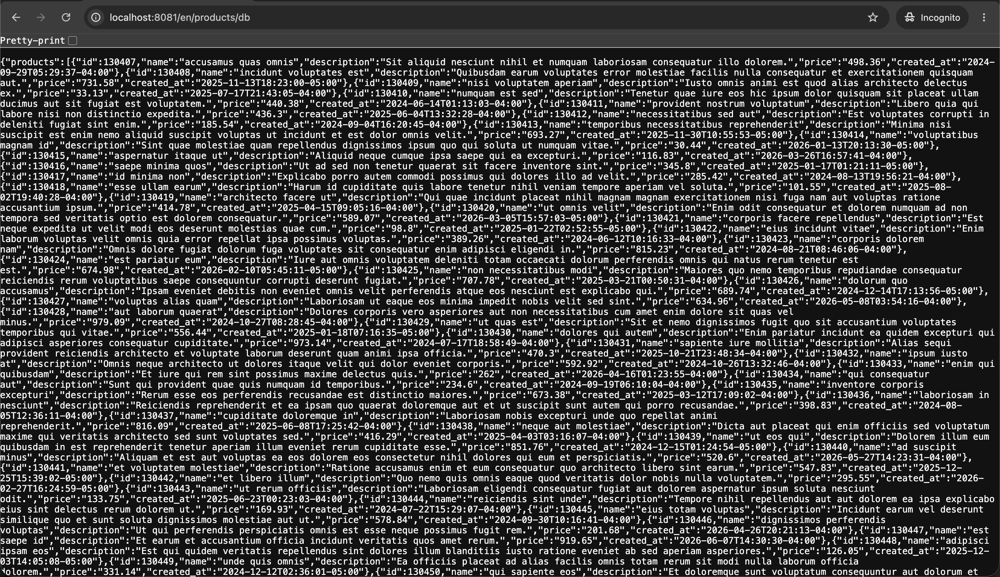
> 📸 *Capture: the browser showing the products JSON at `localhost:8081`. Save as `docs/images/ember-01-products.png`.*

---

## Step 2 - Get the Ember tool

You only do this once. One command, works on **macOS, Linux, and Windows** (it auto-detects your OS and
picks Homebrew, the install script, or `go install`):

```bash
make ember-install
```

Check it's there:

```bash
ember version
```

> Prefer to do it by hand on a Mac? `brew install alexandre-daubois/tap/ember`. If macOS blocks it the
> first time, run `xattr -d com.apple.quarantine $(which ember)` and try again (the installer does this
> for you automatically).

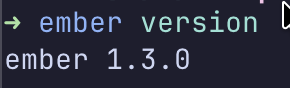
> 📸 *Capture: the terminal after `ember version`. Save as `docs/images/ember-02-version.png`.*

---

## Step 3 - Open the Ember window

In your **first terminal**, run:

```bash
make ember
```

That opens a live dashboard watching the **FrankenPHP worker** (`http://localhost:8081`, the fastest mode,
20 threads - and the one that handles load reliably). Right now the kitchen is quiet, so most numbers are
small (you'll see `RPS 0` - that's normal until we send traffic in Step 4).

> Want to watch **classic** instead (12 threads)? Run `make ember EMBER_ADDR=http://localhost:2019`.

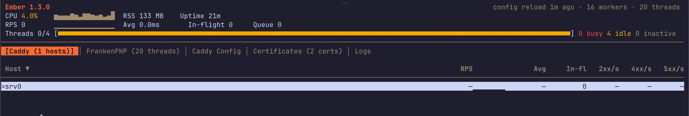
> 📸 *Capture: the dashboard right after it opens. Save as `docs/images/ember-03-open.png`.*

### How to move around Ember (say this to the audience)

**Ember has no mouse - you drive it with the keyboard.** These are the only keys you need:

| Press this        | And it does…                                                       |
|-------------------|--------------------------------------------------------------------|
| **`Tab`**         | Move to the next **tab** at the top (Caddy → FrankenPHP → …).       |
| **`1` … `9`**     | Jump straight to a tab by number.                                  |
| **`↑` / `↓`** (or `j` / `k`) | Move up and down a list.                                |
| **`Enter`**       | Open a **detail** view for the highlighted row.                    |
| **`g`**           | Big **full-screen graphs** (the crowd-pleaser).                    |
| **`p`**           | **Pause** / resume the live updates.                              |
| **`?`**           | Show the help screen with every key.                              |
| **`q`**           | **Quit** Ember.                                                    |

👉 **Do this now:** press **`Tab`** once to land on the **`FrankenPHP (20 threads)`** tab. That's our demo
view - it lists all 20 cooks. (If you switched to classic it'll say 12 threads - same idea.) The first
**`[Caddy]`** tab's "Host" list stays empty in this demo because our server has no website name - that's
expected, just ignore it.

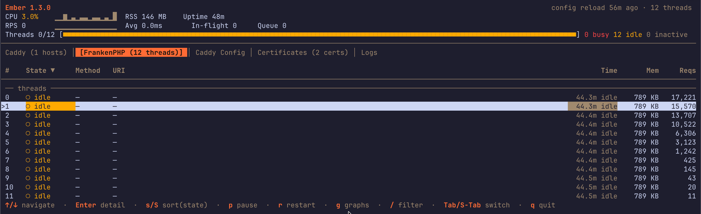
> 📸 *Capture: the `FrankenPHP (… threads)` tab with the thread list. Save as `docs/images/ember-04-threads.png`.*

Here's what the numbers mean, in plain words:

| On screen        | What it really means (kid version)                                              |
|------------------|---------------------------------------------------------------------------------|
| **RPS** ⭐        | Customers arriving **per second**. This is the big one - watch it climb.        |
| **CPU** ⭐        | How hard the kitchen is working. Climbs with the rush.                          |
| **2xx/s** ⭐      | **Happy** orders served per second (green). Tracks the wave up and down.        |
| **Avg / P99**    | How long an order takes. **P99** = "almost the slowest" - 99 of 100 were faster.|
| **Threads busy / idle** | Cooks **working** right now vs cooks **waiting**.                         |
| **In-flight / Queue** | Orders cooking right now / customers waiting in line.                      |
| **4xx / 5xx/s**  | **Problem** orders (red). We want these near zero.                              |
| **RSS**          | How much memory the kitchen is using.                                           |

> The three ⭐ numbers (**RPS, CPU, 2xx/s**) are the ones that move the most - point the audience at those.
> Leave this terminal open and big on the screen.

---

## Step 4 - Send a wave of customers

Open a **second terminal** right next to the first one, and run:

```bash
make ember-load
```

That's it - no flags. It sends a realistic **wave** of visitors at the same **worker** server your
Ember is watching (about a minute). The wave goes:

1. **Up** - a first rush of customers arrives 📈
2. **Down** - the rush calms (people go back to work) 📉
3. **Up and down again** - more sharp rushes, one bigger than the first 📈📉
4. **The biggest rush of all** 📈📈
5. **Empty** - everyone goes home

You'll see the load tool print its own progress bars, and within a few seconds **RPS climbs in the Ember
window** (terminal 1). Zero failures - it just works.

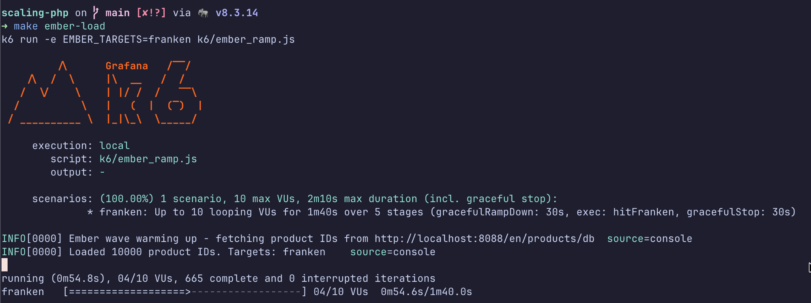
> 📸 *Capture: the k6 output with the ramping VUs. Save as `docs/images/ember-05-wave.png`.*

---

## Step 5 - Watch the numbers go up and down 🔥

Now look back at the Ember window. Press **`g`** for the full-screen graphs - the up-and-down is clearest
there. As the wave grows:

> Still seeing all zeros? Your wave isn't running - go back to Step 4 and start `make ember-load`.

- **RPS climbs** - more customers per second (you'll see it go from ~1 to well over 100).
- **CPU climbs** with it - the kitchen working harder.
- **2xx/s** (the green, happy number) tracks the wave up and down.

When the wave eases, all three **cool back down**. When the second, bigger wave hits, they climb again.
That up–down–up is the heartbeat of a real website. 💓

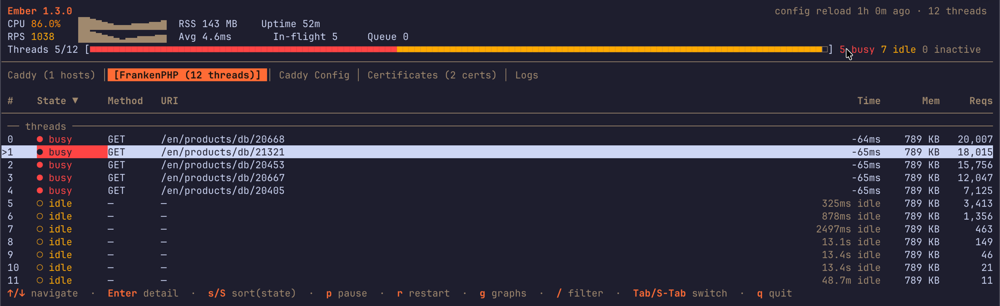
> 📸 *Capture: the dashboard while the wave is busy (RPS/CPU high). Save as `docs/images/ember-06-live.png`.*

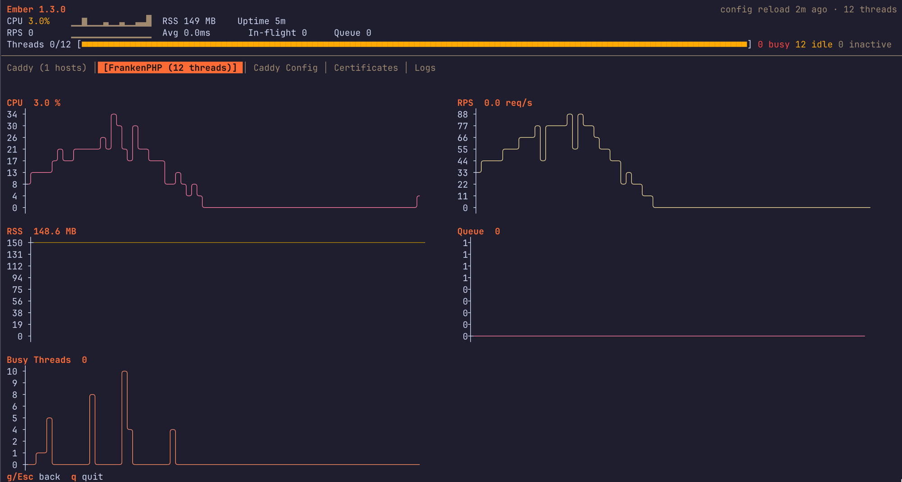
> 📸 *Capture: press `g`, then screenshot the graphs as the wave moves. Save as `docs/images/ember-07-graphs.png`.*

**The punchline for the talk:** even while RPS rockets, the **queue stays tiny** and the cooks barely look
busy. The worker is so fast that customers almost never wait. *That calmness under a crowd is exactly why
FrankenPHP worker mode is special* - say that out loud when the second wave peaks. 🏆

---

## Step 6 - Fun things to press while it runs

Ember is interactive. While it's open, try:

| Key        | What it does                                            |
|------------|---------------------------------------------------------|
| `g`        | **Full-screen graphs** - beautiful for the audience.    |
| `p`        | **Pause / resume** the live updates.                    |
| `Tab` / `1`–`9` | Switch tabs (Caddy hosts, FrankenPHP threads, …).  |
| `Enter`    | Open a **detail** panel for the selected row.           |
| `r`        | **Restart** the FrankenPHP workers (watch them recover).|
| `?`        | Help overlay (all the keys).                            |
| `q`        | Quit.                                                   |

Tip for the talk: hit **`g`** right when the second wave climbs - the graphs make the "up and down" obvious
from the back of the room.

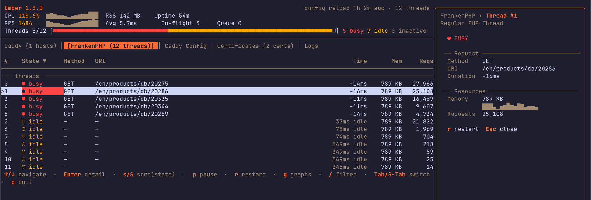
> 📸 *Capture: press `Enter` on a thread to open its detail panel. Save as `docs/images/ember-08-detail.png`.*

When you're done, press **`q`** to quit Ember, and **Ctrl-C** in the other terminal to stop the wave.

### The other tabs

Press **`Tab`** to cycle through the rest. They're handy to show off live:

**Caddy Config** - the whole server config as a tree (press `Enter` to expand):

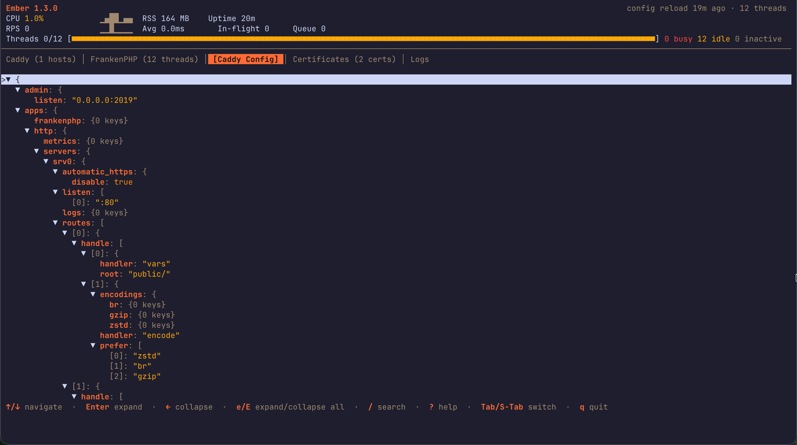

**Certificates** - the TLS certs Caddy is managing, with expiry days:

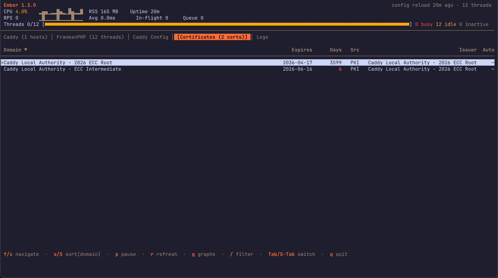

**Logs** - Caddy's Runtime log (server startup / errors):

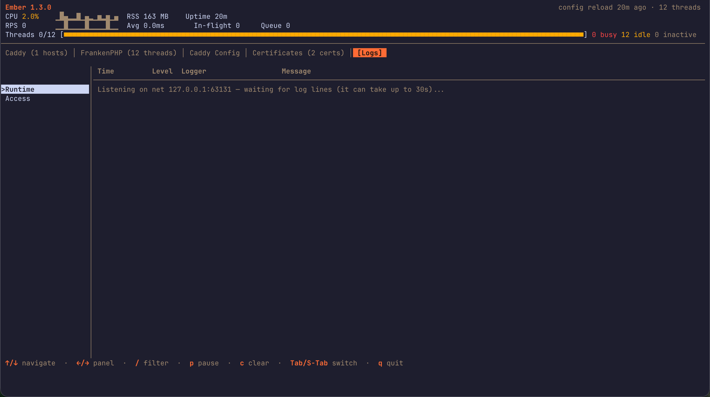

---

## Bonus - see all three runtimes at once (`make compare`)

Ember zooms into one FrankenPHP server. If you want the **side-by-side** view - PHP-FPM vs FrankenPHP
classic vs the worker, all reacting to the same wave - use the little companion that ships with this repo:

```bash
# terminal 1
make compare
# terminal 2 - drives ALL THREE at once
make compare-load
```

> ⚠️ Use **`make compare-load`** here, not `make ember-load`. Plain `make ember-load` only hits the worker,
> so the FPM and classic bars would sit near zero. `make compare-load` hits all three.

`make compare` draws one glowing bar per runtime, so the audience can see the **worker's req/sec rocket past
the other two** in a single screen. (Press Ctrl-C to quit.)

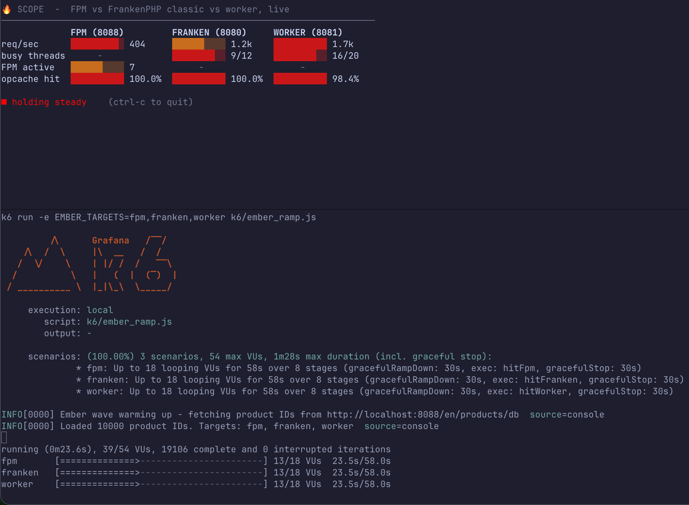
> 📸 *Capture: `make compare` while the wave runs. Save as `docs/images/ember-09-compare.png`.*

---

## Want to watch a different server?

By default `make ember` watches the **worker** (`http://localhost:2020`). You can point Ember anywhere:

```bash
ember --addr http://localhost:2019   # the "classic" FrankenPHP (port 8080)
ember --addr http://localhost:2020   # the worker (port 8081) - the default
```

And you can aim the traffic wave at one or more servers:

```bash
make ember-load                                   # just the worker (the default - what this guide uses)
EMBER_TARGETS=franken make ember-load             # just classic
EMBER_TARGETS=fpm,franken,worker make ember-load  # all three at once
```

---

## Troubleshooting

**`make ember` says it can't connect / "Caddy unreachable".**
The worker isn't up. Start it and try again:

```bash
make up-worker
ember status --addr http://localhost:2020   # quick one-line health check
```

**`ember: command not found`.**
You skipped Step 2. Install it with `brew install alexandre-daubois/tap/ember`.

**A server returns PHP errors (e.g. `Call to undefined function ...`) right after first setup.**
That server started before `composer install` finished, so its memory cache is stale. Give it a clean
restart:

```bash
docker compose up -d --force-recreate franken-worker   # or franken / app
```

**RPS stays at 0 in Ember even though the wave is running.**
The wave warms up by fetching product IDs from the **app server on :8088** - if that fetch fails, k6
still shows its progress bars for the full run but sends **zero** real traffic, so Ember never moves.
Scroll to the top of the k6 output: if you see `Could not load product IDs`, make sure **all** of Step 1
ran - `make up` (the app on :8088 must be running, not just the worker) and `make setup` (the database
must be filled) - then start the wave again.

**The wave says it couldn't load product IDs.**
Same cause as above: the app on :8088 isn't running (`make up`) or the database isn't filled yet
(`make setup`). Fix that and try again.
