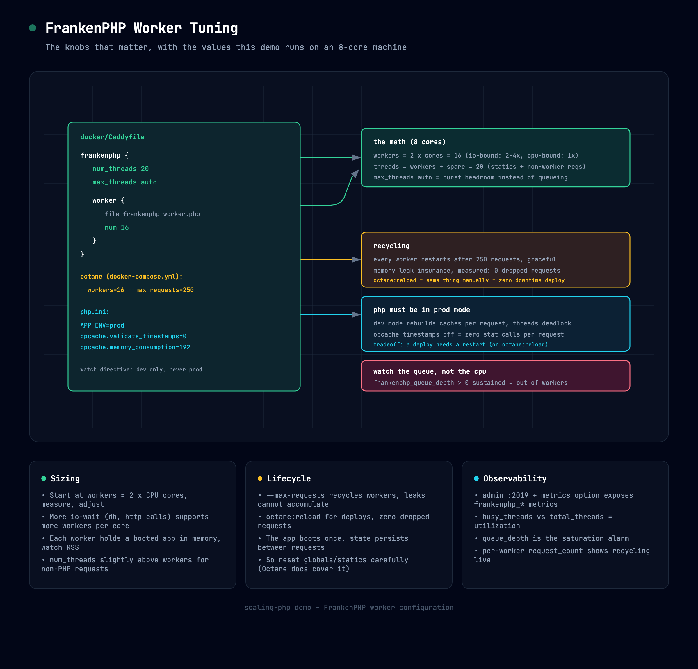

# FrankenPHP Worker (Laravel Octane)

The star runtime: FrankenPHP running **Laravel Octane** in worker mode. The app boots
**once**, then 16 workers keep it in memory and answer requests without ever
re-bootstrapping. That is where the big numbers come from.

## Bring it up

> First time here? Bootstrap the app once: `make up && make setup` (see [fpm.md](fpm.md)).

```bash
make up-worker
```

Check it: http://localhost:8081/products

Prove the app stays alive between requests:

```bash
curl -s localhost:8081/runtime | jq
curl -s localhost:8081/runtime | jq
```

`octane_worker_mode` is true and `requests_served_by_this_worker` **climbs across
calls** - a static PHP variable surviving HTTP requests. On :8088 and :8080 it is
always 1. If it is not climbing here, you are not in worker mode (stale image -
run `make rebuild`).

## How it runs

The container runs (docker-compose.yml):

```
php artisan octane:frankenphp --workers=16 --max-requests=250
```

- **--workers=16** - concurrent app instances, sized for an 8-core machine
  (rule of thumb: 2x cores). Override per machine:
  `OCTANE_WORKERS=28 docker compose up -d franken-worker`
- **--max-requests=250** - each worker retires after 250 requests and restarts
  fresh, so memory leaks cannot accumulate. See
  [disposable-workers.md](disposable-workers.md), including the mid-load
  `make octane-reload` zero-downtime demo. Override with `OCTANE_MAX_REQUESTS`
- Caddy config: `docker/Caddyfile.octane` (adds the `metrics` option and admin
  `origins` so Prometheus and Ember work)

## Tuning cheat sheet



Interactive version: [docs/diagrams/franken-tuning.html](docs/diagrams/franken-tuning.html).
The one rule to remember: **watch `frankenphp_queue_depth`, not CPU** - a growing queue
means you are out of workers.

## The catch: state persists

The app never dies between requests, so anything static or global carries over.
Laravel and Octane handle the framework side, but your own static caches, memoized
singletons and leaking listeners are on you. The Octane docs cover the patterns.

## Metrics

- App + Caddy metrics for browsers: http://localhost:8081/metrics
- Admin API (Prometheus scrapes this): http://localhost:2020/metrics - includes
  `frankenphp_ready_workers`, per-worker request counts, `frankenphp_queue_depth`
- Watch it live: `make ember` (the worker is the default target)

## Benchmark it

```bash
make benchmark-product-by-id-franken-worker
make benchmark-product-random-franken-worker
```

Measured on this repo (50 VUs, 30s, same endpoint): **~2,516 rps @ 20ms avg**, roughly
3.5x PHP-FPM and 4x classic. Full chart: `docs/images/runtime-benchmark.png`.
