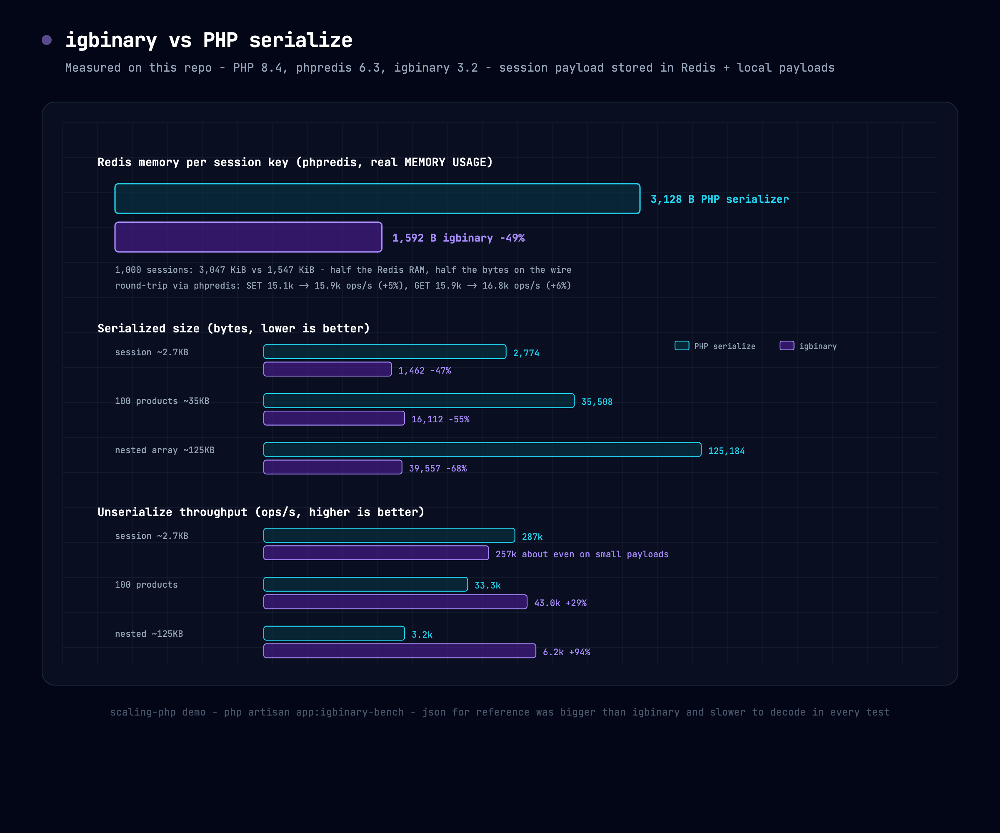
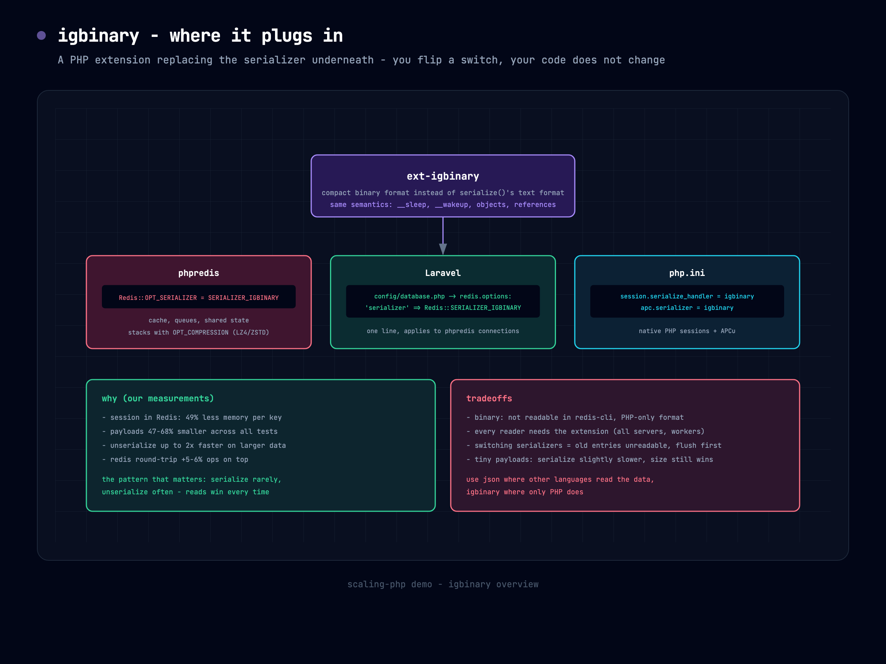

# igbinary - the drop-in serializer

Everything PHP stores in Redis, sessions, or caches gets serialized first. PHP's native
`serialize()` produces a verbose text format; **igbinary** is a PHP extension that
produces a compact binary format instead, with the same API shape:
`igbinary_serialize()` / `igbinary_unserialize()`. You rarely call it yourself - you
flip a config switch and the layer underneath uses it.

## Where it plugs in

**phpredis** (what this repo benchmarks):

```php
$redis->setOption(Redis::OPT_SERIALIZER, Redis::SERIALIZER_IGBINARY);
```

**Laravel** - one line in `config/database.php`:

```php
'redis' => [
    'options' => [
        'serializer' => Redis::SERIALIZER_IGBINARY,
    ],
],
```

**Native PHP sessions** (php.ini):

```ini
session.serialize_handler = igbinary
```

**APCu** (php.ini):

```ini
apc.serializer = igbinary
```

> Note for Laravel sessions specifically: Laravel serializes session payloads itself
> before they reach the store, so the phpredis serializer option mainly benefits
> Cache::put/get of arrays and objects. The native session handler setting applies to
> plain-PHP session apps.

## Our measured results

PHP 8.4.24, phpredis 6.3.0, igbinary 3.2, this repo's app container, redis 7.
Reproduce with `php artisan app:igbinary-bench`.



**Session payload (~2.7KB realistic Laravel-style session) stored in Redis via phpredis:**

| | PHP serializer | igbinary | delta |
|---|---|---|---|
| Redis MEMORY USAGE per key | 3,128 B | 1,592 B | **-49%** |
| 1,000 sessions in Redis | 3,047 KiB | 1,547 KiB | **half the RAM** |
| SET ops/s | 15,145 | 15,864 | +5% |
| GET ops/s | 15,895 | 16,771 | +6% |

**Local serialize/unserialize (json_encode/decode shown for reference):**

| payload | size php / igbinary / json | unserialize ops php / igbinary / json |
|---|---|---|
| session ~2.7KB | 2,774 / **1,462 (-47%)** / 1,901 | 287k / 257k / 129k |
| 100 products ~35KB | 35,508 / **16,112 (-55%)** / 27,971 | 33.3k / **43.0k (+29%)** / 11.8k |
| nested ~125KB | 125,184 / **39,557 (-68%)** / 83,176 | 3.2k / **6.2k (+94%)** / 2.1k |

Honest reading: on small payloads the CPU difference is noise (igbinary a few percent
slower to serialize, similar to unserialize); the size cut is what you buy. On larger
structures igbinary wins CPU outright, up to 2x on unserialize. JSON was bigger than
igbinary and slower to decode in every test.

**Stacking compression on top (phpredis `OPT_COMPRESSION`, same session payload):**

| mode | bytes per key | 1k sessions | SET ops/s | GET ops/s |
|---|---|---|---|---|
| PHP serializer, no compression | 3,128 B | 3,047 KiB | 18,164 | 16,185 |
| igbinary | 1,592 B | 1,547 KiB | 17,040 | 16,086 |
| igbinary + LZ4 | 1,336 B (-57%) | 1,297 KiB | 16,511 | 16,710 |
| igbinary + ZSTD | **952 B (-70%)** | **922 KiB** | 14,462 (-20%) | 15,490 (-4%) |

LZ4 is nearly free and takes another slice off. ZSTD costs ~20% on writes but
reads stay within 4% and the payload drops to less than a third of the original.
For session/cache data that is written once and read often, ZSTD is the win.
One more option pair in `config/database.php` redis options:
`Redis::OPT_COMPRESSION => Redis::COMPRESSION_ZSTD`.



## The story for the slides

- **Size: roughly half.** Binary format, no quoted keys and repeated type prefixes;
  `igbinary.compact_strings` deduplicates repeated strings. Halving payloads halves
  Redis RAM for sessions and halves bytes on the wire.
- **Unserialize: consistently faster.** The usage pattern that matters is "serialize
  rarely, unserialize often" - a session is written once per request but the hot path
  reads. Real-world reports: 10-30% faster pages, ~50% less time spent unserializing
  (Drupal core issue data).
- **Serialize: about the same, sometimes slightly slower on tiny payloads.** The
  compression work costs a little; it pays back on every read.
- **Pairs with compression.** phpredis can stack `Redis::OPT_COMPRESSION` (LZ4/ZSTD)
  on top of igbinary for large values.

## Tradeoffs

- Binary and PHP-only: not human readable in redis-cli, and nothing but PHP (with the
  extension) can read it - use JSON where other languages consume the data
- Every reader needs ext-igbinary: all app servers, workers, tinker sessions
- Switching serializers on live data = old entries unreadable: flush the cache/session
  store when migrating
- Objects keep the usual `serialize()` semantics (`__sleep`/`__wakeup`,
  `Serializable`), so behaviour is drop-in

## Benchmarks by other people

- igbinary's own benchmark suite: https://github.com/igbinary/igbinary/blob/master/benchmark/comparisons.php
- Native vs json vs igbinary vs msgpack on session-like arrays (size + speed gist):
  https://gist.github.com/spajak/d07a999deb0430e2b6b7e58fc44213d1
- Drupal + phpredis + igbinary field reports (10-30% page gains, ~50% unserialize
  reduction, ~50% size cut, up to 3x on some data):
  https://www.drupal.org/project/redis/issues/2143149 and
  https://www.drupal.org/project/igbinary/issues/3357130
- Ilia Alshanetsky, "Igbinary, the great serializer": https://ilia.ws/blog/igbinary-the-great-serializer
- phpredis vs predis on production data (why phpredis in the first place):
  https://akalongman.medium.com/phpredis-vs-predis-comparison-on-real-production-data-a819b48cbadb

## Reproduce our numbers

```bash
make rebuild
docker compose exec app php artisan app:igbinary-bench
```
