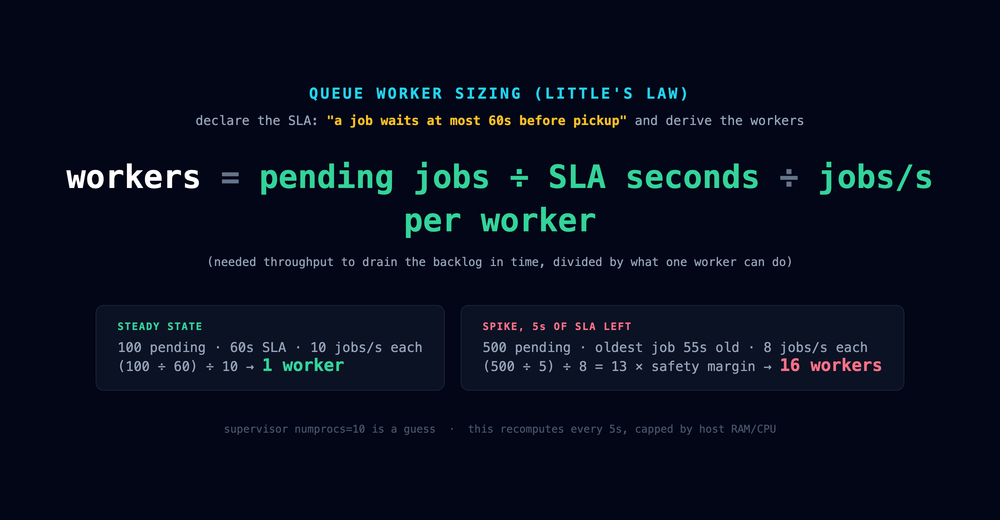
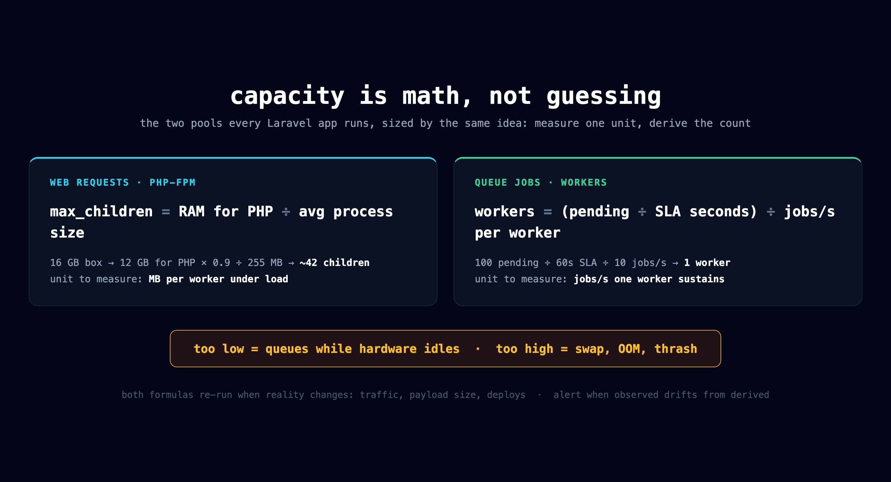
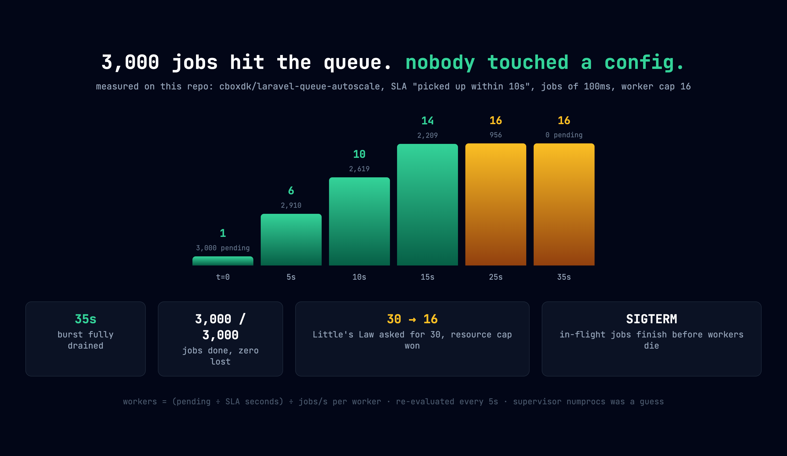
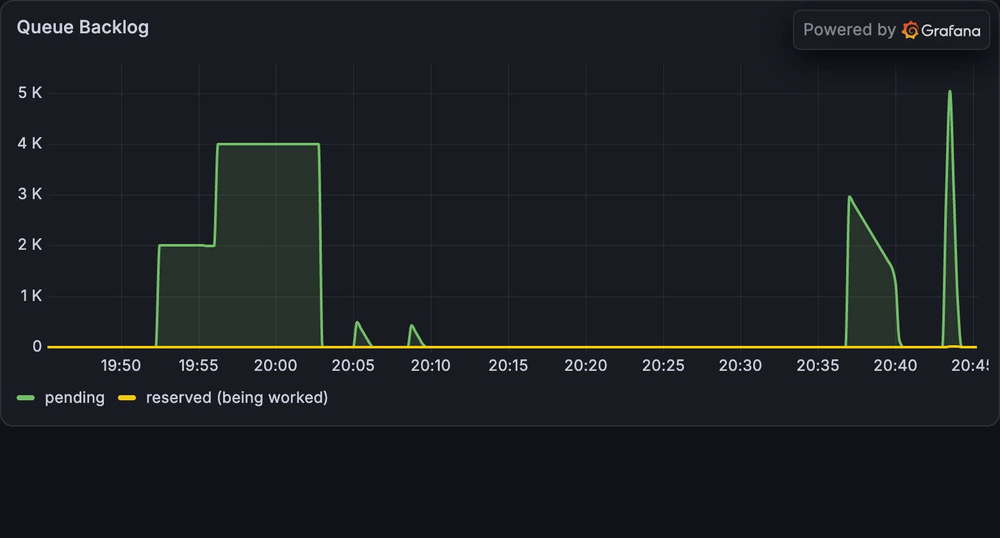
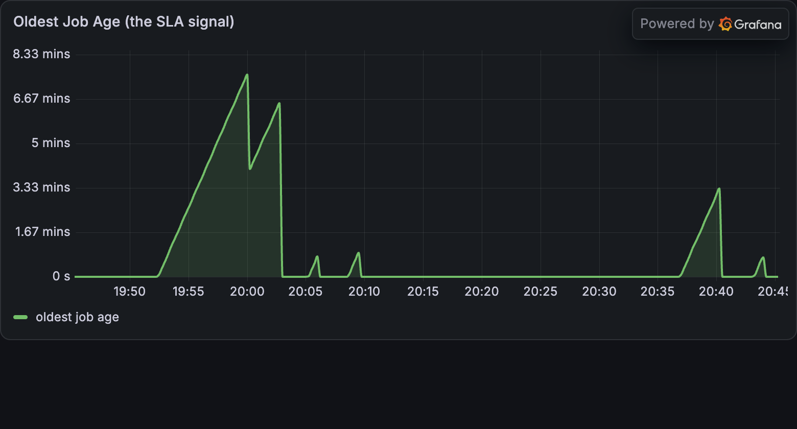
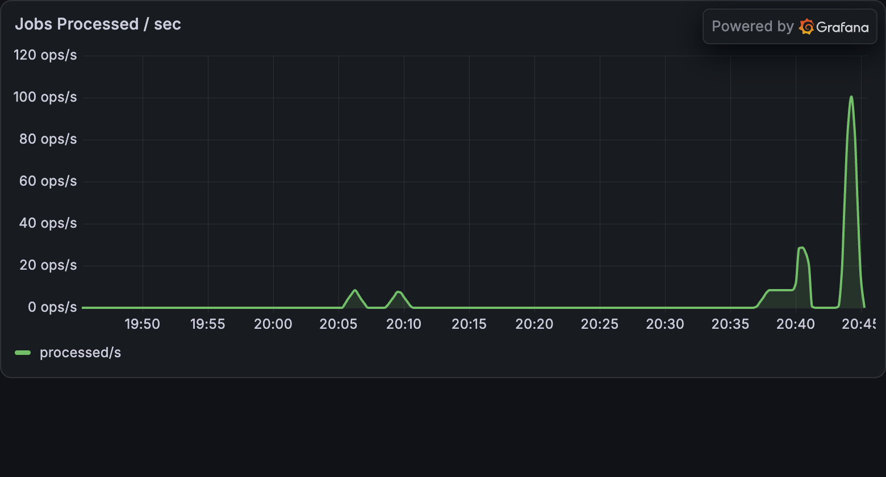
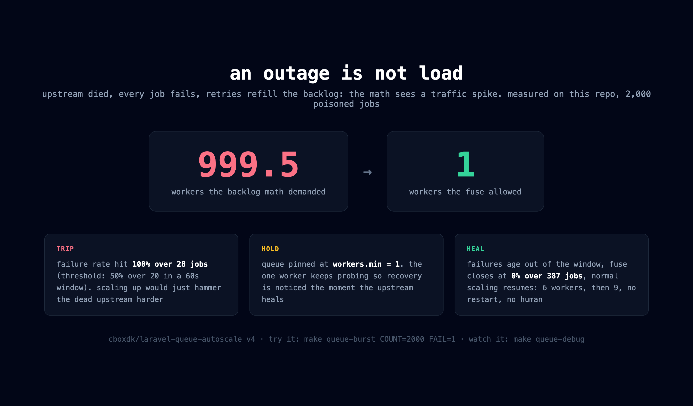
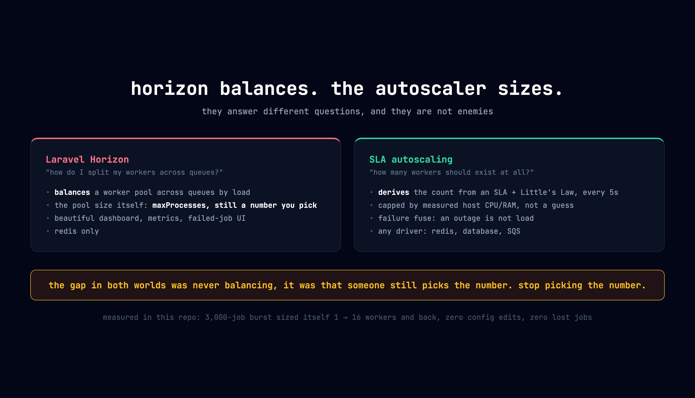

# Laravel queues: worker count is math, not a config value

Most Laravel deployments hardcode the worker count (`numprocs=10` in supervisor)
the same way they guess `pm.max_children`. This repo demos the alternative:
declare an SLA and let the worker count be derived, using
[cboxdk/laravel-queue-autoscale](https://cbox.dk/packages/laravel-queue-autoscale)
and [cboxdk/laravel-queue-metrics](https://cbox.dk/packages/laravel-queue-metrics)
by Sylvester Damgaard (ex-Laravel, worked on the queue manager).

## The formula (Little's Law)



```
workers = (pending jobs / SLA seconds) / jobs per second per worker
```

You declare one thing: "a job on the `orders` queue must be picked up within
10 seconds" (`config/queue-autoscale.php`). Every 5 seconds the manager measures
backlog, processing rate, and p95 pickup time, then solves for the worker count.
When the oldest job gets close to the SLA it switches to backlog-drain math
(remaining time instead of full SLA) and scales harder. Worker counts are capped
by measured host CPU/RAM, not just the config max.

Same principle as FPM pool sizing (`max_children = RAM / avg process size`):
measure one unit, derive the count. Web requests spend memory, queue jobs spend
time; everything else is identical:



## What is in this repo

- `app/Jobs/ProcessOrder.php`: demo job, simulates ~100ms of work
- `GET /orders/dispatch?count=3000&work_ms=100`: burst-dispatch jobs
- `GET /orders/queue-status`: pending + processed counters
- `config/queue-autoscale.php`: the `orders` queue, 10s SLA, 1-16 workers
- Queue driver is redis (`QUEUE_CONNECTION=redis`), phpredis + igbinary already
  in the image

## Run the demo (3 terminals)

```bash
make queue-autoscale   # terminal 1: the manager (spawns/kills queue:work)
make queue-watch       # terminal 2: worker count + backlog every 2s
make queue-burst       # terminal 3: dump 3000 jobs on the queue
```

Terminal 3 confirms the burst instantly (the jobs are in redis before the
response returns):

```
curl -s "http://localhost:8088/orders/dispatch?count=3000&work_ms=100&fail=0"
{"dispatched":3000,"queue":"orders","work_ms":100,"fail":false}
```

Terminal 1 shows the manager and every job each worker runs:

```
Starting Queue Autoscale Manager
   Manager ID: f3d983deb7e1-8a5fedae3b1f
   Mode: single-host
   Evaluation interval: 5s

[Worker 1]   2026-08-20 13:37:03 App\Jobs\ProcessOrder ............... RUNNING
[Worker 1]   2026-08-20 13:37:03 App\Jobs\ProcessOrder ....... 106.74ms DONE
[Worker 2]   2026-08-20 13:37:03 App\Jobs\ProcessOrder ............... RUNNING
[Worker 2]   2026-08-20 13:37:03 App\Jobs\ProcessOrder ....... 111.73ms DONE
```

Higher worker numbers appearing (`[Worker 7]`, `[Worker 12]`...) means a
scale-up just happened. Terminal 2 is the compact view of the same thing:

```
workers=1  {"pending":3000,"processed":0}
workers=6  {"pending":2910,"processed":90}
workers=14 {"pending":2209,"processed":791}
workers=16 {"pending":956,"processed":2044}
workers=16 {"pending":0,"processed":3000}
```

Reset everything between runs (pending, failed jobs, counter, fuse memory):

```bash
make queue-reset
```

## Measured on this repo (M-series MacBook, Docker)



3,000 jobs of 100ms dispatched at once against a 10s pickup SLA:

| t | workers | pending | processed |
|---|---------|---------|-----------|
| 0s | 1 | 3,000 | 0 |
| 5s | 6 | 2,910 | 90 |
| 10s | 10 | 2,619 | 381 |
| 15s | 14 | 2,209 | 791 |
| 25s | 16 (max) | 956 | 2,044 |
| 35s | 16 | 0 | 3,000 |

Little's Law asked for `(3000 / 10s) / 10 jobs/s = 30` workers; the configured
cap of 16 won. All 3,000 jobs completed, none lost, and on shutdown (SIGTERM)
every worker finished its in-flight job first.

Scale-down is deliberately slow (one worker per cycle, cooldown between
reversals) so a bursty queue does not flap.

## The queue row in Grafana

The FPM dashboard (http://localhost:3000) has a "Laravel Queue (orders)" row at
the bottom, fed by our `/metrics` route. These captures are one real test
session, and each shape teaches something:



Backlog: the flat-top plateau (19:53-20:03) is the fuse test, thousands
pending and nothing draining because the fuse held workers at min during a
simulated outage. The sloped triangle (20:37) is a cold-started manager
learning then draining. The spike that vanishes instantly (20:44) is a burst
against a warmed-up manager.



Oldest job age, the SLA signal: slope up = jobs aging, cliff down = drained.
The 7.7 minute peak is what an outage looks like; the tiny end blips are
healthy bursts where age never escaped single-digit seconds.



Processed/s: near zero during the fuse plateau (every job was failing, and the
counter only counts successes), then ~100 jobs/s at the end, 13 workers
draining a 5k burst at full speed.

## 16 workers, one queue: why they do not fight

The claim is atomic. When a worker asks redis for work, Laravel runs a Lua
script that pops the job off `queues:orders` AND copies it into
`queues:orders:reserved` as one indivisible operation. Redis runs Lua
single-threaded, so two workers can never grab the same job. No locks in your
code, no conflicts. A job is always in exactly one of three keys
(`make queue-debug` shows them):

```
queues:orders            waiting, anyone can claim
queues:orders:reserved   claimed, being worked right now
queues:orders:delayed    scheduled for later / retry backoff
```

Our runs prove it: 3,000 dispatched, `processed` landed on exactly 3,000.

**But the guarantee is at-least-once, not exactly-once.** The reservation has a
timeout (`retry_after`, 90s default in `config/queue.php`). If a worker claims
a job and dies without finishing (kill -9, OOM, reboot), redis moves the job
back to pending after 90s and another worker runs it. That safety net is also
the duplicate risk:

- worker finishes the job but crashes before deleting the reservation: runs twice
- a job takes longer than `retry_after`: a second worker starts it mid-flight

So the rules:

1. **Make jobs idempotent** (safe to run twice). Payment jobs use an
   idempotency key. Our demo counter `Redis::incr` is fine for a demo, not for
   money.
2. **`retry_after` must be longer than your slowest job.** Misconfiguring this
   is the number one real-world cause of mystery duplicate jobs.
3. For business-level guarantees Laravel has `ShouldBeUnique` (one instance in
   the queue at all) and `WithoutOverlapping` (serialize jobs sharing a key).

## The failure fuse: an outage is not load



To a naive autoscaler a downstream outage looks exactly like a traffic spike:
jobs fail, retries refill the backlog, the backlog math demands more workers,
and 16 workers hammer the dead API instead of 1. We reproduced it:

```bash
make queue-burst COUNT=2000 FAIL=1
```

Every job throws (simulated dead upstream). Measured on this repo:

- Backlog math demanded **999.5 workers** ("backlog=1999 requires 999.5 workers
  to prevent SLA breach", from the manager log)
- The fuse tripped at 100% failure rate over 28 jobs (threshold: 50% over 20+
  jobs in a 60s window) and **held the queue at workers.min = 1**
- Once jobs stopped failing, the window aged out, the fuse closed
  (0% over 387 jobs) and scaling resumed normally: 6 workers, then 9

Watch it live with `make queue-debug` (a Failure Fuse section shows
open/closed state and the observed failure rate). This needs
laravel-queue-autoscale v4 (`composer.json` pins `^4.0`); v3 only dampens the
arrival-rate estimate and will happily scale into the outage, which we also
measured (16 workers burning retries into `failed_jobs`).

## Horizon is not the competitor



Horizon answers "how do I split my workers across queues?" (balancing inside a
pool whose size you still pick via maxProcesses). The autoscaler answers "how
many workers should exist at all?" (deriving the size from the SLA). Different
questions; they can even compose. The gap in both worlds was never balancing,
it was that someone still picks the number.

## Tradeoffs, honestly

- **Scales processes, not machines.** Workers spawn on the host the manager
  runs on; the resource cap is also the ceiling. Multi-host needs cluster mode
  (Redis, leader election). On Kubernetes many teams scale pods with KEDA
  instead. For apps on 1-3 VMs, process-level is exactly right.
- **Young project, one maintainer.** We found a real bug in hours of use
  (queue-metrics' broken Prometheus endpoint, see Gotchas). Horizon has years
  of mileage; this does not yet.
- **Version churn.** The fuse only exists in v4, which needs PHP 8.4+,
  ext-pcntl and ext-posix (no Windows dev, CI needs platform-req ignores).
  v3 happily scales into an outage; we measured it.
- **The manager needs supervising.** If it dies, its workers go with it. Run
  it under systemd or a container restart policy, and run it continuously:
  frequent restarts make the first scale-up lazy.
- **Fuse granularity is per queue.** One consistently failing job type can pin
  a whole queue to minimum workers. Separate queues by job type anyway.
- **No UI.** Horizon has a dashboard and retry buttons; this has metrics and
  logs. We built Grafana panels ourselves (see fpm dashboard, Laravel Queue
  row).

The framing: the idea (derive, do not configure) is solid, textbook queueing
theory. The implementation is promising but young, so bring monitoring and
read the changelog.

## Gotchas we hit

- The manager needs `ext-pcntl` (signal handling). Added to `docker/Dockerfile`,
  same as the Franken image needed it for Octane.
- Each entry under `queue-autoscale.queues` needs an explicit
  `'connection' => 'redis'`, otherwise the package looks up a queue connection
  literally named `default` and every evaluation fails.
- `opcache.validate_timestamps=0` applies to routes/config too: after adding the
  dispatch routes, FPM kept serving the old route table until `make fpm-reload`.
  Our own opcache slide, live.
- Run the manager continuously (that is the production model). A freshly
  started manager is blind: no measured processing rate, no pickup samples, so
  facing a pre-existing backlog it holds at min for a minute or two while its
  own worker generates the measurements, then ramps. Real capture of exactly
  that (manager restarted onto ~2,500 pending):

  ```
  workers=1  {"pending":1511,"processed":2489}   learning
  workers=5  {"pending":1492,"processed":2508}   estimators warmed up
  workers=6  {"pending":1209,"processed":2791}
  workers=10 {"pending":763,"processed":3237}
  workers=13 {"pending":193,"processed":3807}
  workers=13 {"pending":0,"processed":4000}      drained
  ```

  The manager even logs its reasoning: first
  `arrival_rate=0.00/s x job_time=2.0s = 0.0 workers` (blind, fallback guess),
  later `backlog=1054 requires 2635.0 workers to prevent SLA breach` (measured,
  ramping). Under one long-running manager the same burst ramps within seconds.
  For a live demo: start the manager before the talk and never restart it.
- v3.2.1 of queue-metrics has a broken `/queue-metrics/prometheus` endpoint
  (reads `success_count`, the DTO writes `total_processed`). We export queue
  gauges through our own `/metrics` route instead; the JSON API endpoints
  (`/queue-metrics/health` etc.) work fine.

## Debugging

```bash
make queue-debug                 # raw queue state as the autoscaler sees it
docker compose exec app php artisan queue:autoscale:cluster
```

Captured mid-burst, this is what healthy-under-load looks like:

```
Pending             5698        Reserved 7 = 7 jobs inside workers right now,
Reserved            7           so 7 workers were busy at this instant
Delayed             0
Oldest Pending Age  10 seconds  at the SLA edge: backlog-drain about to fire

=== Failure Fuse ===
State          closed           0.0% (0 of 222 jobs): jobs succeed, this is
                                load, not an outage, scaling unconstrained

=== Raw Queue Data (driver: redis) ===
queues:orders            LIST   5698
queues:orders:reserved   ZSET   7
queues:orders:delayed    ZSET   0
```

Or inspect the three redis keys directly (Laravel prefixes them with
`laravel-database-`; pending is a LIST, the other two are sorted sets):

```bash
docker compose exec redis redis-cli llen laravel-database-queues:orders
docker compose exec redis redis-cli zcard laravel-database-queues:orders:reserved
docker compose exec redis redis-cli zcard laravel-database-queues:orders:delayed
docker compose exec redis redis-cli lrange laravel-database-queues:orders 0 0
```

Run the `reserved` one mid-burst: it sits close to the live worker count,
because reserved literally is "jobs inside workers right now". The `lrange`
shows one job's body: a queued job is just serialized JSON in a redis list.
